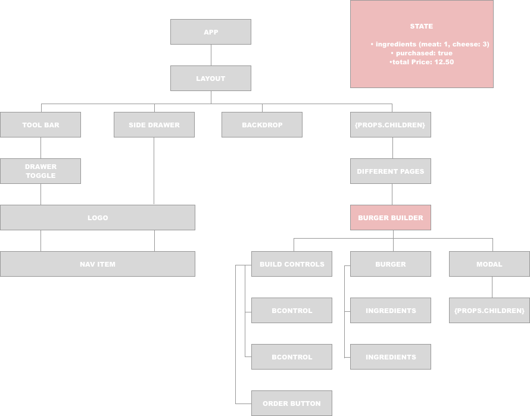
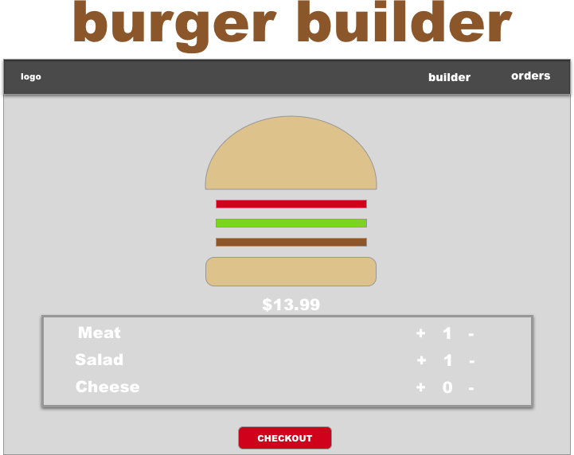

# Burger Builder
#### Practice with React

## Description
This webpage will allow a user to create a burger by selecting what they would like on it, receive a total and be able to check out.

## Project Layout/ Planning

## Setup
1. Clone this repository
2. type npm install in your terminal
3. After npm install is finished, type npm run start
4. navigate to http://localhost:3000/

## Specifications
1. User can click on desired ingredient to add it to their burger
2. User can checkout once burger is built

## Technologies Used
* Javascript
* JSX
* React
* CSS

## Legal
2018 Created with Udemy "React 16 - The Complete Guide" by: Maximilian Schwarzmüller
